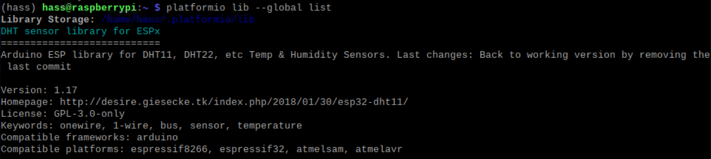

# DHT22 custom sensor for ESPHome

# Background
[Adafruit DHT sensor library](https://github.com/adafruit/DHT-sensor-library) is a brilliant library to read data off a DHT temperature and humidity sensor on Arduino. However, using this library on an ESPxxx board (i.e. ESP8266 or ESP32) yields `NaN` as its value for somewhat reason.

Hence, the library [DHT sensor library for ESPx](https://github.com/beegee-tokyo/DHTesp) came to saviour.

# :question: What is this repository doing then?

DHTesp is an Arduino library - this repository pulls together the required stuff to make DHT22 sensor works with ESPHome.

Think it is more like a documentation for myself. :open_book:

# Pre-requisite

* ESPHome must be installed. Visit [esphome.io](https://esphome.io/) for installation guide.

* Running the command below should show the version number (if ESPHome is installed)
  ```bash
  $ esphome version
  ```

* PlatformIO should be installed along with ESPHome. Confirm by running the command below:
  ```bash
  platformio --version
  ```

## Installation of platformio library for ESPHome

1. Run
    ```bash
    platformio lib search dht
    ```
2. Locate the library name "**DHT sensor library for ESPx**". Take note of the ID, e.g. `#2029`

3. Run
    ```bash
    platformio lib --global install 2029
    ```
    to install the said library. `2029` is the ID.

4. Upon a successful installation, running platformio lib --global list should show:

    

## Include custom sensor for ESPHome

1. Download `dht22_esp.h`.
2. Copy it to ESPHome config folder.

## YAML in ESPHome

1. Include the header file and library in the project configuration

   ```yaml
    esphome:
      name: project1
      platform: ESP32
      board: nodemcu-32s
      includes:
        - dht22_esp.h
      libraries:
        - 'DHT sensor library for ESPx'
   ```

2. Define the custom sensor and its configuration under `sensor` section:

    ```yaml
    sensor:
    - platform: custom
      lambda: |-
        auto dht = new DHT22CustomSensor(33, 60 * 1000);
        App.register_component(dht);
        return { dht->temperature_sensor, dht->humidity_sensor, dht->heat_index_sensor , dht->dew_point_sensor };
      sensors:
        - name: 'Temperature'
          unit_of_measurement: °C
          accuracy_decimals: 1
        - name: 'Humidity'
          unit_of_measurement: '%'
          accuracy_decimals: 1
        - name: 'Heat index'
          unit_of_measurement: °C
          accuracy_decimals: 1
        - name: 'Dew point'
          unit_of_measurement: °C
          accuracy_decimals: 1
    ````

    | Parameter | Example | Description |
    | --- | --- |  --- |
    | Constructor first param | `new DH22CustomSensor(33, ...)` | The GPIO pin number |
    | Constructor second param | `new DH22CustomSensor(xx, 60 * 1000)` | Refresh interval in millisecond(s) |
